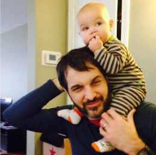

**Chris Blackburn**

Chris works for [NIST](http://www.nist.gov) (formerly the National Bureau of Standards) in the field of measurement science, also known as [metrology](http://en.wikipedia.org/wiki/Metrology). Most people have either never heard of this, or think it has something to do with the [weather](http://en.wikipedia.org/wiki/Meteorology). Chris himself mistakenly believed he was getting into meteorology at first.

Chris's interests include playing the drums, watching the Memphis Grizzlies, origami, Lego, and writing code. He is a new dad to a beautiful little stinker called Jack. Chris and his family live in Silver Spring, MD.

**Chris Crook**

Chris is a Senior Developer at KCIC, a DC-based insurance consulting firm.  He primarily develops using the .NET stack using Git for source control (a recent transition from TFS).  He is looking to finish up his Computer Science masters degree from JHU in Software Engineering later this year.  Chris attended The College of William and Mary for undergrad and received a BBA in Process Management & Consulting with a concentration in Finance and a minor in Computer Science.

_Fun fact_: Chris can ride a unicycle and owns a 5ft tall "giraffe".
